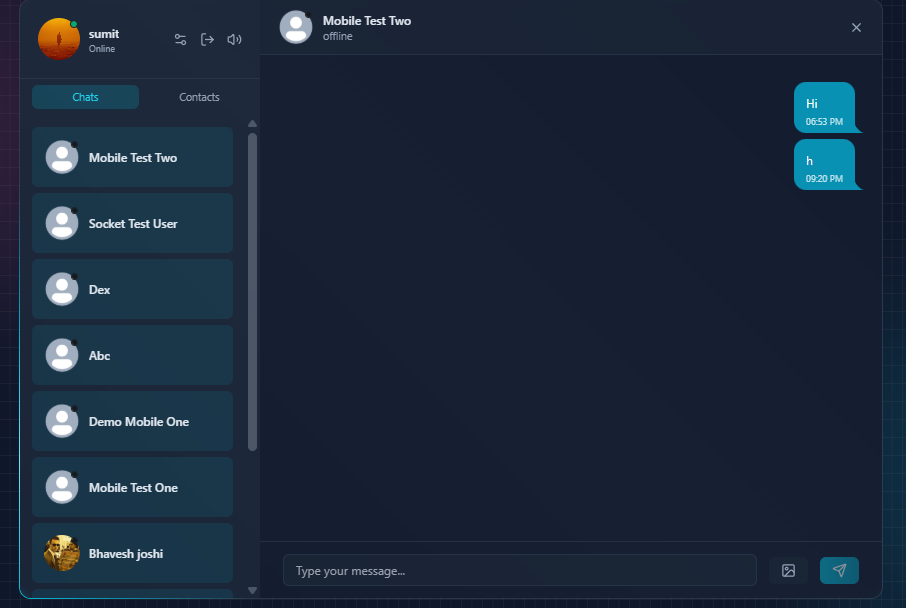
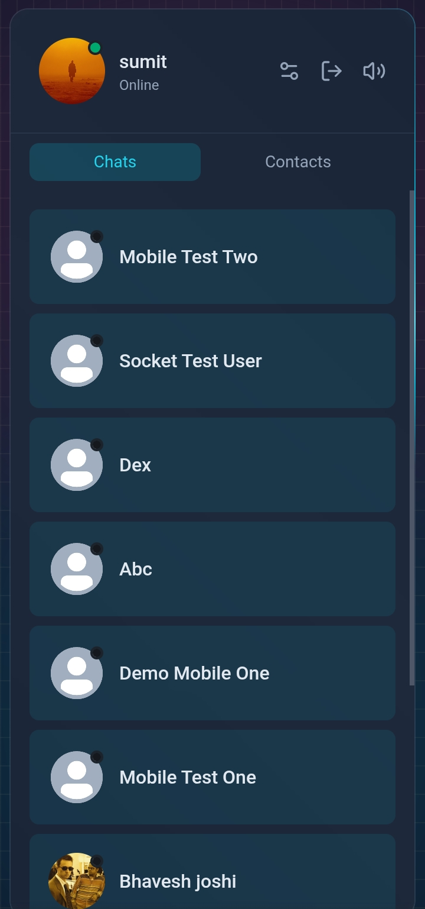
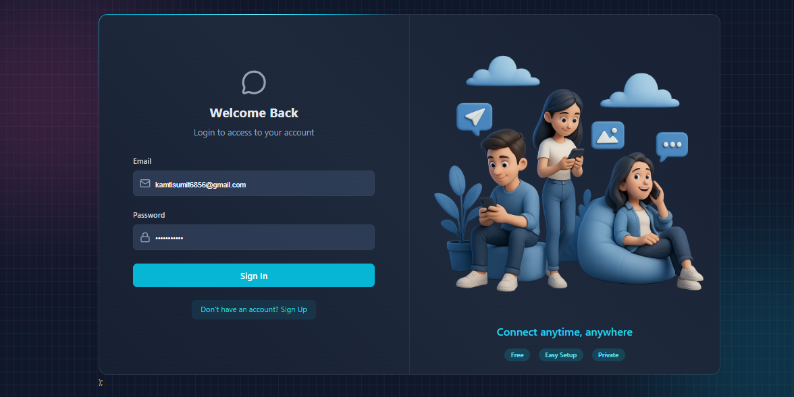
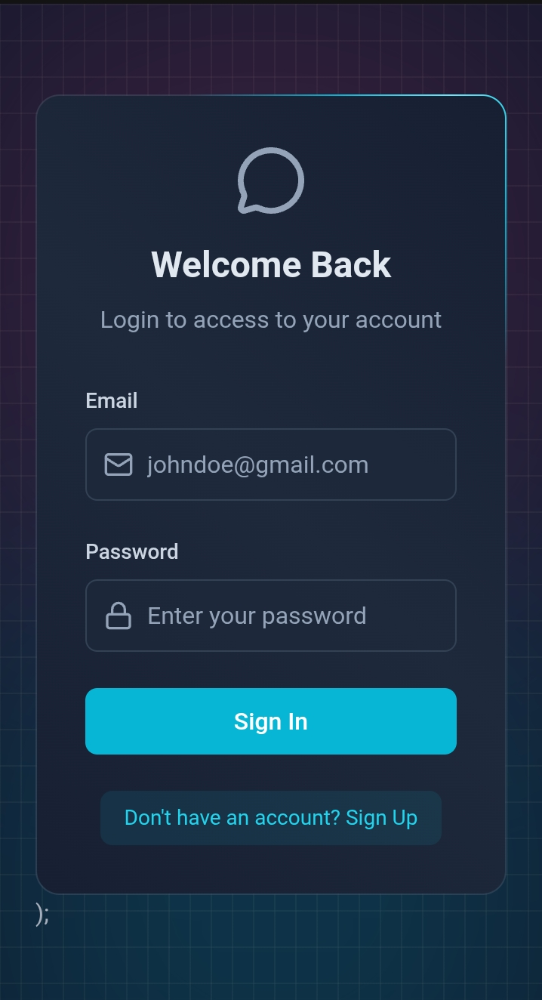
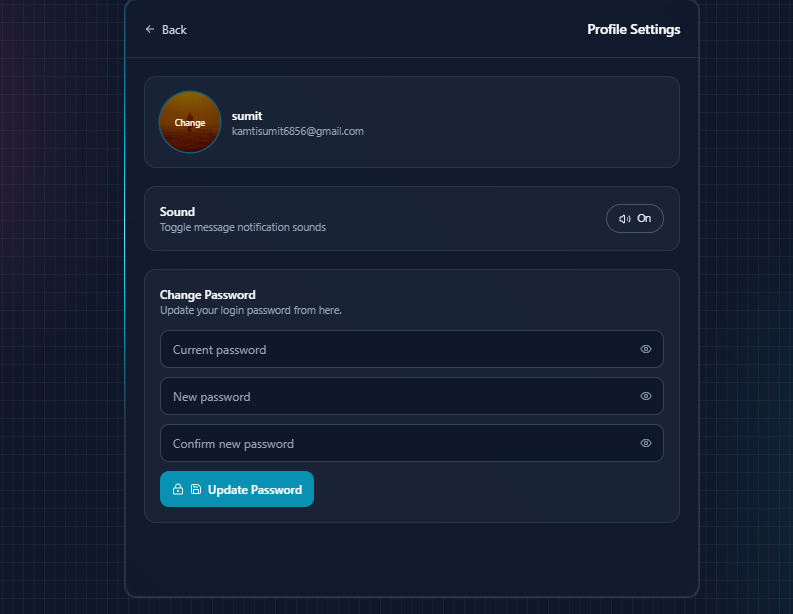
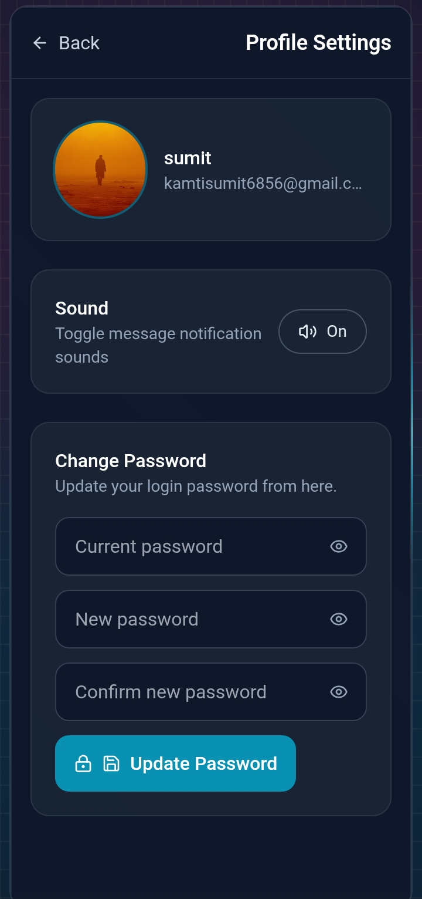

# Live Chat Application

A high-performance, containerized, real-time chat application modernized with zero-knowledge End-to-End Encryption (E2EE), offline-first local caching, scalable WebSocket architecture, and active spam protection.

[Live Demo — try it now](https://live-chat-2o2o.onrender.com/)

## Screenshots

The screenshots below are arranged as a compact view matrix so the page layout is easy to scan at a glance.

| Page | Desktop | Mobile |
| ---- | ------- | ------ |
| Chat Page | <br>906 × 608 | <br>720 × 1537 |
| Login Page | <br>1176 × 589 | <br>718 × 1324 |
| Edit Profile | <br>793 × 614 | <br>720 × 1532 |

---

## ⚡ Modernized Architecture Highlights

### 🔒 1. Zero-Knowledge End-to-End Encryption (E2EE)
*   **Cryptographic Derivation**: Client keys are derived locally using the browser-native **Web Crypto API** (PBKDF2/SHA-256) dynamically generated from sorted participant IDs and a client-side secret pepper.
*   **AES-GCM (256-bit)**: Message text is encrypted on the client before network transit. The backend server and MongoDB database **only store and transmit ciphertext**, rendering data completely secure in the event of database breaches.

### 💾 2. Offline-First Local Cache (IndexedDB)
*   **Instant Load**: Active chat threads load instantly from the browser's local **IndexedDB** database (`LiveChatLocalDB`) without requesting data from the server.
*   **Delta Synchronization**: On chat load, the app executes a background query checking for new messages since the last saved timestamp (`GET /api/message/:id?since=timestamp`), reducing database and API load.

### 🌐 3. Scalable WebSocket Architecture
*   **Redis Pub/Sub scaling**: Configured `@socket.io/redis-adapter` for multi-instance horizontal backend scaling.
*   **Shared Redis presence mapping**: Online presence is mapped to a shared Redis hash (`online_users`) with safe in-memory fallback for local development.
*   **Optimal Heartbeats**: Ping interval is tuned (`pingInterval: 10000`, `pingTimeout: 5000`) for rapid disconnect cleanup.
*   **Socket Compression**: Enabled Gzip `perMessageDeflate` frame compression for payloads over 1KB.

### 🛡️ 4. WebSocket Rate Limiting (Anti-Spam)
*   **Packet Interceptor**: Implemented a custom connection-level `socket.use` middleware that intercepts client event packets.
*   **Sliding Window**: Users are rate-limited to 10 events per 5 seconds (managed via Redis counts, falling back to local memory track). Excess packets are dropped, logging server blocks and returning a `rateLimitError` warning to the client UI.

### 🔑 5. Dual-Token Authentication (Vercel & Railway Optimized)
*   **HTTP-Only Cookies**: Secured session cookies for same-site development.
*   **Authorization Headers Fallback**: Modified backend/frontend routers to support `Authorization: Bearer <token>` authorization. This prevents session blocking on cross-domain hosting (like Vercel to Railway) where browsers block third-party cookies by default.

---

## 🛠️ Tech Stack

### Frontend
*   **React 19 / Vite** (SPA routing with React Router)
*   **Zustand** (Global state management)
*   **IndexedDB** (Offline message local storage)
*   **Web Crypto API** (PBKDF2 & AES-GCM 256-bit encryption)
*   **Socket.io client** (Direct WebSocket transport)
*   **Tailwind CSS + DaisyUI** (Modern dark-mode UI styling)

### Backend
*   **Node.js / Express** (REST API endpoints)
*   **MongoDB with Mongoose** (Database persistent layer)
*   **Redis** (Pub/sub adapter & active presence caching)
*   **Socket.io server** (Scalable real-time event pipeline)
*   **Resend** (Welcome email services)
*   **Arcjet** (Server security protection middleware)
*   **Cloudinary** (Secure image uploads)

---

## 📂 Project Structure

```
.
├── docker-compose.yml     # Containerized service orchestration
├── Frontend/
│   ├── vercel.json        # Vercel SPA routing rewrites
│   ├── src/
│   │   ├── Pages/         # Route pages (Login, Signup, Profile, Home)
│   │   ├── components/    # Layout, Sidebar, MessageInput, ChatContainer
│   │   ├── store/         # Zustand store (AuthStorer, chatAuthstore)
│   │   └── lib/           # localDb cache, Web Crypto, Axios config
│   └── public/            # Static assets and sounds
└── Backend/
    ├── Dockerfile         # Docker production environment config
    ├── src/
    │   ├── controllers/   # Auth, message, and password handlers
    │   ├── routes/        # Express API routing configuration
    │   ├── models/        # Database schemas (User, Message)
    │   ├── middleware/    # Auth, Arcjet, and Socket auth interceptors
    │   ├── lib/           # Socket configs, db, cloud seeding, test scripts
    │   └── server.js      # App startup entry point
```

---

## 🚀 Getting Started

### 1. Prerequisites
*   Node.js (`v18+` recommended)
*   MongoDB Atlas cluster (Free tier)
*   Upstash Redis instance (Free tier serverless Redis)

### 2. Environment Variables

Create **`Backend/.env`**:
```env
PORT=3000
MONGODB_URL=mongodb+srv://...
JWT_SECRET=your_jwt_secret
NODE_ENV=development
CLIENT_URL=http://localhost:5173
REDIS_URL=rediss://default:...
CLOUDINARY_CLOUD_NAME=...
CLOUDINARY_API_KEY=...
CLOUDINARY_API_SECRET=...
RESEND_API=...
EMAIL_FROM=...
EMAIL_FROM_NAME=...
```

Create **`Frontend/.env`**:
```env
VITE_CRYPTO_PEPPER=custom-pepper-key-for-local-encryption
```

### 3. Run Locally

Install dependencies:
```bash
# Backend
cd Backend && npm install
# Frontend
cd ../Frontend && npm install
```

Start servers:
```bash
# Start Backend
cd Backend && npm run dev
# Start Frontend
cd Frontend && npm run dev
```

### 4. Run with Docker
Start the entire containerized architecture with one command:
```bash
docker compose up --build
```

---

## 🧪 Testing and Database Administration

We provided database utility scripts inside `Backend/src/lib/` to aid development and diagnostics:

*   **Seed Dummy Accounts**: Run `node src/lib/seed.js` inside `/Backend` to populate your database with 5 test users (default password: `password123`).
*   **Update Profile Pictures**: Run `node src/lib/update-pfp.js` to assign stable letter-based Cloudflare CDN avatars to all test accounts.
*   **Clear Database Messages**: Run `node src/lib/clear-messages.js` to quickly delete message records and reset your message collections.
*   **Socket Spam Test**: Run `node src/lib/test-rate-limit.js` to simulate a WebSocket flood attack and verify your server rate limiter is functioning.

---

## 📄 License

Licensed under the [ISC License](LICENSE).
